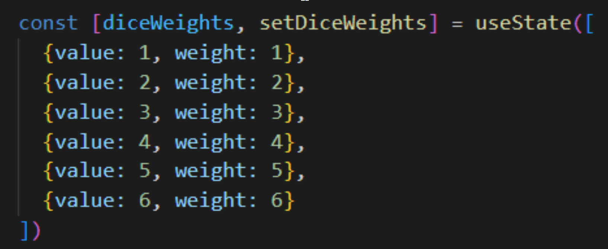
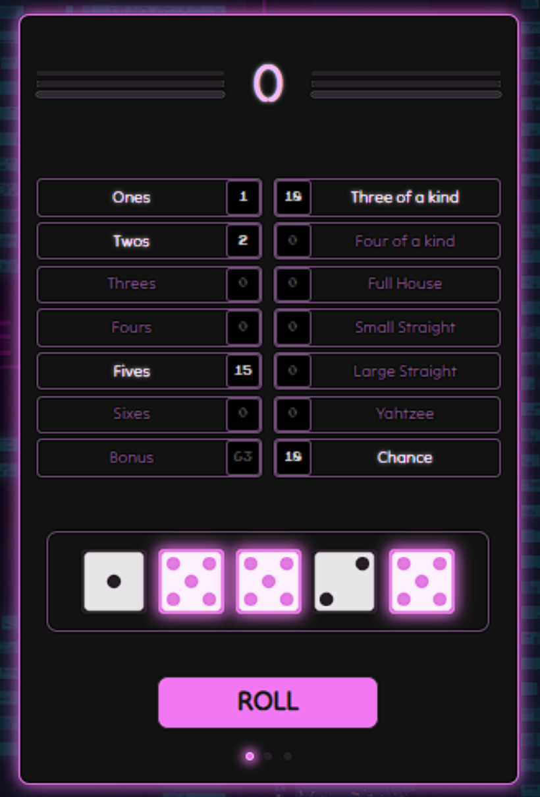
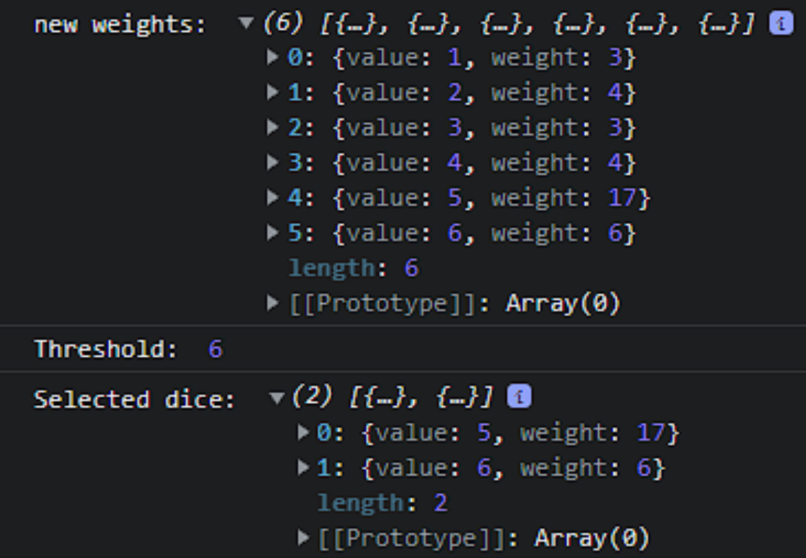
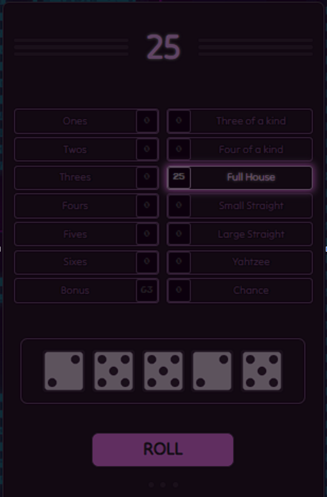
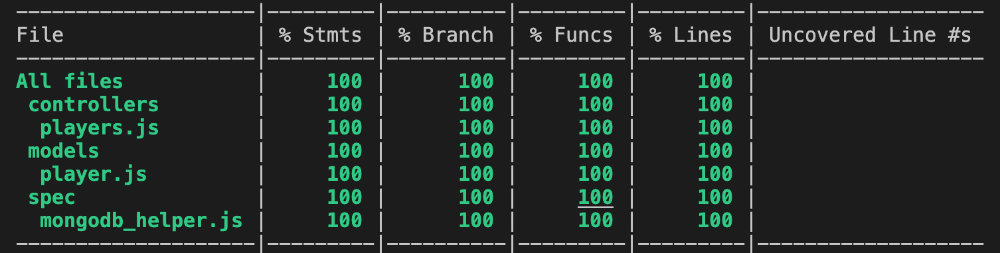

# YAHTZEE

<!--  -->


---
## Contents
  - [The Game](#the-game)
  - [Features](#features)
  - [The Yahtzee bot](#the-yahtzee-bot)
  - [Technologies used](#technologies-used)
  - [Installation and usage](#installation-and-usage)
  - [How to play](#how-to-play)
  - [Testing](#testing)
  - [Gallery](#gallery)
  - [Credits](#credits)
---

## The Game

### Introduction
Welcome to our Yahtzee game built using the MERN stack! This game is a digital adaptation of the classic dice game set in a cyberpunk universe. In this universe, the game takes on a new meaning, becoming a symbol of rebellion against the oppressive forces that dominate society. The game mechanics and strategic aspects of Yahtzee translate seamlessly into this theme, as players must use their skills and wit to outscore their opponents.

### The design
The game's design is essential for creating an immersive and engaging gameplay experience. The UI is user-friendly and intuitive, making it easy for players to navigate the game menus and interact with the game's features. The game's visual design and aesthetics create an immersive atmosphere that transports players to a cyberpunk universe. The sound design enhances the game's atmosphere and creates a more memorable experience for players.

### The challenge
Yahtzee is a game that involves a lot of complex logic and strategy, making it an interesting challenge to implement in code. Each turn, the player has to make decisions based on the roll of the dice and the categories they can score in. There are also rules governing how many times the player can reroll the dice, and which categories can be scored at different points in the game.

Implementing all of these rules and logic in a digital format requires careful planning and programming. The game also involves a lot of random chance, which makes it a good challenge to implement in a way that feels fair and balanced. Additionally, building a multiplayer version of the game adds an extra layer of complexity, as each players need to have their own game logic isolated from the others.

### Conclusion
Overall, building a Yahtzee game in code requires a combination of programming skills, logical thinking, and game design experience. It was a fun challenge for us, and it is also a great opportunity to showcase our technical abilities.


<br/>


<!--  -->

---
## Features

- Single-player mode
- Local multiplayer mode
- AI player
- Save score to leaderboard
- Leaderboards to track high scores

---

## The Yahtzee bot

This bot idea comes from playing a lot of ‘Total War’ games, and the fact that AI player actions are given precedence given the state of the game.

Our yahtzee AI player uses dice which are assigned weights given their resulting value.



<br/>

After a roll, the weights are adjusted and a threshold is calculated to inform the bot-player what dice they should hold for the next roll.




<br/>

When a final decision or the end of the round is reached, this data is parsed through the core logic which determines which box should be selected given the state of play. 



---

## Technologies Used

This Yahtzee game was built using the MERN stack, which includes:

- MongoDB for the database
- Express.js for the server
- React.js for the frontend
- Node.js for the backend
- CSS for the styling and animations
- Jest for backend testing
- Cypress for frontend and integration testing

Other technologies and tools used include:
- Cakewalk for audio recording and editing.
- Helm and Synth1 synthesizers for creating SFX and music
<br/>

---

## Installation and usage

- Download or clone this repository to your local machine.
- Navigate to the root directory of the project in your terminal
- Run the following commands:
> If you already have NVM and Node installed, jump to step 3
<br>

1. Install NVM - once done, restart your terminal
```
curl -o- https://raw.githubusercontent.com/nvm-sh/nvm/v0.39.1/install.sh | bash
```

2. Install Node.js
```
nvm install node
nvm use node
```

3. Install dependencies in the root directory
```
npm install
```

4. Run the server
```
npm run start
```

5. Repeat step 3 in the API directory
```
cd api
npm install
```

6. Run the backend server and connect to the database
```
npm run start
```
<br/>

Alternatively, you can connect to the database test
```
npm run start:test
```

Once you've installed the program and run the server, simply press play to start a new game.

If it does not, navigate to `http://localhost:3000/` to view the game.
<br/>

---
## How to play

<h3>Goal</h3>
The goal of the game is to score as many points as possible by 
rolling specific combinations of numbers over the course of 13 rounds

<h3>Turns</h3>
On each turn, a player is allowed up to three rolls to try and 
achieve the highest-scoring combination. 
After each roll, they can choose to save some of the dice and 
re-roll the rest to increase their chances of getting a better combination.

<h3>Rounds</h3>
Each round has a different scoring category, 
and players must choose which category to use based on the results of their roll. 
For example, if a player rolls three fives, 
they could choose to score those points under the "Fives" category. 
However, if they already have a high score in the Fives category, 
they might choose to score the roll under another category, 
such as "Three of a Kind" or "Chance." 
The ultimate goal is to score the highest possible number of points by the end of the 13 rounds.


<h3>Yahtzee</h3>
One of the most exciting aspects of Yahtzee is the possibility of getting a <b>Yahtzee</b>, 
which is when all five dice show the same number. If a player rolls a Yahtzee, 
they get 50 points, plus the ability to score additional points by using the Yahtzee as 
a wild card in other categories. 
For example, if a player rolls a Yahtzee and chooses 
to use it in the "Full House" category, they would score 25 points for the Full House, 
plus an additional 50 points for the Yahtzee.

<h3>Bonus</h3>
In addition to the main scoring categories, 
there are also bonus points available for players who score a high number of points in 
the upper section of the scorecard. If a player scores at least 63 points in the upper section, 
they get a bonus of 35 points, which can make a big difference in the final score.

<br/>
Overall, Yahtzee is a fun and exciting game that requires both luck and strategy. 
With its simple rules and fast-paced gameplay, 
it's no wonder that it has remained a popular game for generations.

<br/>

[Learn more about Yahtzee](https://en.wikipedia.org/wiki/Yahtzee)
<br/>

---

## Testing

We used Jest to test the backend (100% coverage) and Cypress to test the frontend of this application.
Jest comes with a wide range of testing tools, including test runners, assertions, and mocking functionality. 

Additionally, it has a large and supportive community of developers and is well-documented, making it an excellent choice for testing MERN stack apps.

Cypress is a testing framework designed specifically for end-to-end testing of web applications. It offers an intuitive API for interacting with web elements and allows you to write tests that simulate user behaviour.

### Installation instructions
1. Install cypress
```
npm install cypress --save-dev
``` 

2. open cypress for the first time
```
./node_modules/.bin/cypress open
```

3. open cypress app

```
npx cypress open 
```

### Running the tests

To run the tests in the back-end, navigate to the root directory with your terminal and run:
```
cd api
jest
```

To run the test in front-end, just navigate to the root directory and run
```
npm run coverage
```

<!--  -->


<br/>

---

## Gallery


---
## Credits

This project was created by (alphabetical order)
- Callum Clark
- Chang Wynn
- Josh Neuwford
- Paul Lazar
- Valeria Serci


